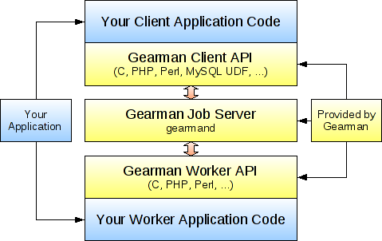

**File Name** calling-java-from-php.md  

**Description** 在 PHP 中调用 java    
**Author** LiCunchang(printf@live.com)   
**Version** 3.0.20130728  

------

PHP 官方提供了两种方式来桥接 java 和 php ：

* 把 php 集成到 java 的 servlet 环境中，这种方式稳定高效，实现方法是基于 php 提供的一个 SAPI 模块，模块实现了 servlet server 的接口
* 把 java 集成到 php 中，这种方式是基于扩展，但是这个扩展是实验性质的，使用这种方式有一定的冒险

以上两种方式都有其局限性，高手在民间，sourceforge 上有一个 **PHP/Java Bridge** 的项目，提供了另外一种方式。底层实现是一种基于 XML 的网络协议，

基本上可以看出就是一种基于专有协议的调用，不支持多语言，适用性有限。

## Apache Thrift

目前流行的服务调用方式有很多种，例如基于 SOAP 消息格式的 Web Service，基于 JSON 消息格式的 RESTful 服务等。其中所用到的数据传输方式包括 XML，JSON 等，然而 XML 相对体积太大，传输效率低，JSON 体积较小，新颖，但还不够完善。由 Facebook 开发的远程服务调用框架 Apache Thrift，它采用接口描述语言定义并创建服务，支持可扩展的跨语言服务开发，所包含的代码生成引擎可以在多种语言中，如 C++, Java, Python, PHP, Ruby, Erlang, Perl, Haskell, C#, Cocoa, Smalltalk 等创建高效的、无缝的服务，其传输数据采用二进制格式，相对 XML 和 JSON 体积更小，对于高并发、大数据量和多语言的环境更有优势。

Thrift 具有自己内部定义的传输协议规范(TProtocol)和传输数据标准(TTransports)，通过IDL脚本对传输数据的数据结构(struct) 和传输数据的业务逻辑(service)根据不同的运行环境快速的构建相应的代码，下面是 thrift 的架构图：

Thrift 实际上是实现了 C/S 模式，通过代码生成工具将接口定义文件生成服务器端和客户端代码（可以为不同语言），从而实现服务端和客户端跨语言的支持。用户在 Thirft 描述文件中声明自己的服务，这些服务经过编译后会生成相应语言的代码文件，然后用户实现服务（客户端调用服务，服务器端提服务）便可以了。其中 protocol（协议层, 定义数据传输格式，可以为二进制或者XML等）和 transport（传输层，定义数据传输方式，可以为 TCP/IP 传输，内存共享或者文件共享等）被用作运行时库。

### 支持的数据传输格式、数据传输方式和服务模型

* 支持的传输格式

    * TBinaryProtocol – 二进制格式.
    * TCompactProtocol – 压缩格式
    * TJSONProtocol – JSON格式
    * TSimpleJSONProtocol –提供JSON只写协议, 生成的文件很容易通过脚本语言解析。
    * TDebugProtocol – 使用易懂的可读的文本格式，以便于debug

* 支持的数据传输方式

    * TSocket -阻塞式socker
    * TFramedTransport – 以frame为单位进行传输，非阻塞式服务中使用。
    * TFileTransport – 以文件形式进行传输。
    * TMemoryTransport – 将内存用于I/O. java实现时内部实际使用了简单的ByteArrayOutputStream。
    * TZlibTransport – 使用zlib进行压缩， 与其他传输方式联合使用。当前无java实现。

* 支持的服务模型

    * TSimpleServer – 简单的单线程服务模型，常用于测试
    * TThreadPoolServer – 多线程服务模型，使用标准的阻塞式IO。
    * TNonblockingServer – 多线程服务模型，使用非阻塞式IO（需使用TFramedTransport数据传输方式）

### 支持的类型

* 基本类型

    * bool：布尔类型(true or value)，占一个字节
    * byte：有符号字节
    * i16:16位有符号整型
    * i32:32位有符号整型
    * i64:64位有符号整型
    * double：64位浮点数
    * string：未知编码或者二进制的字符串

* 容器类型

    * List<t1>：一系列t1类型的元素组成的有序表，元素可以重复
    * Set<t1>：一系列t1类型的元素组成的无序表，元素唯一
    * Map<t1,t2>：key/value对（key的类型是t1且key唯一，value类型是t2）

### demo

做一个简单的例子，其中 IDL 定义文档 `love.thrift`

    namespace java com.licunchang.love
    namespace php love
    namespace go love

    enum Gender
    {
        MALE = 1,
        FEMALE = 2,
        SHEMALE = 3
    }

    enum Orientation
    {
        HETEROSEXUAL = 1,
        HOMOSEXUAL = 2,
        BISEXUAL = 3
    }

    struct People
    {
        1: string name,
        2: i32 age,
        3: Gender gender,
        4: bool married,
        5: Orientation orientation
    }

    exception LoveNotFoundException {
        1: i32 code,
        2: string message
    }

    exception ShemaleException {
        1: i32 code,
        2: string message
    }

    service FindMyLove
    {
        People random();

        People whoami(1: string name);

        bool couple(1: People yourself, 2: People people)throws(1: LoveNotFoundException err1, 2: ShemaleException err2),
    }

生成代码

    thrift --gen php love.thrift
    thrift --gen java love.thrift

将 /usr/local/src/thrift-0.9.1/lib/php/lib 目录下的 Thrift 拷贝到项目下，这里是 /data/web/test.utrans.com/lib

客户端使用 PHP 的例子：

    <?php

    require_once __DIR__.'/lib/Thrift/ClassLoader/ThriftClassLoader.php';

    use Thrift\ClassLoader\ThriftClassLoader;

    $loader = new ThriftClassLoader();
    $loader->registerNamespace('Thrift', __DIR__ . '/lib');
    $loader->registerDefinition('love', __DIR__.'/gen-php');
    $loader->register();

    use Thrift\Protocol\TBinaryProtocol;
    use Thrift\Transport\TSocket;
    use Thrift\Transport\THttpClient;
    use Thrift\Transport\TBufferedTransport;
    use Thrift\Exception\TException;

    use love\FindMyLoveClient;
    use love\ShemaleException;
    use love\LoveNotFoundException;

    try {
        $socket = new TSocket('10.10.10.10', 8081);
        $transport = new TBufferedTransport($socket);
        $protocol = new TBinaryProtocol($transport);
        $client = new FindMyLoveClient($protocol);

        $transport->open();

        $me = $client->whoami("LiLei");
        var_dump($me);

        $people = $client->random();
        var_dump($people);

        try {
            $success = $client->couple($me, $people);
            echo $success ? "What a wonderful day!" : "Oh, my!";
        }
        catch (ShemaleException $io) {
            echo "ShemaleException: $io->message ";
        }
        catch (LoveNotFoundException $io) {
            echo "LoveNotFoundException: $io->message ";
        }

        $transport->close();
    }
    catch (TException $tx) {
        echo 'TException: '.$tx->getMessage()." ";
    }

服务器端使用 Java ，Override 生成的代码，编写自己的处理逻辑

    package com.licunchang.love;

    import org.apache.thrift.TException;

    public class FindMyLoveHandler implements FindMyLove.Iface{

        @Override
        public People random() throws TException {
            System.out.println("random()");
            People people = new People();
            // TODO do something
            people.age = 23;
            people.gender = Gender.FEMALE;
            people.married = false;
            people.name = "demo";
            people.orientation = Orientation.HETEROSEXUAL;
            
            return people;
        }

        @Override
        public People whoami(String name) throws TException {
            System.out.println("whoami()");
            People people = new People();
            // TODO do something
            people.age = 23;
            people.gender = Gender.MALE;
            people.name = name;
            people.married = false;
            people.orientation = Orientation.HETEROSEXUAL;
            return people;
        }

        @Override
        public boolean couple(People yourself, People people)
                throws LoveNotFoundException, ShemaleException, TException {
            // TODO Auto-generated method stub
            System.out.println("couple()");
            return false;
        }

    }

注册服务

    package com.licunchang.love;

    import org.apache.thrift.protocol.TBinaryProtocol;
    import org.apache.thrift.protocol.TBinaryProtocol.Factory;
    import org.apache.thrift.server.TServer;
    import org.apache.thrift.server.TServer.Args;
    import org.apache.thrift.server.TSimpleServer;
    import org.apache.thrift.server.TThreadPoolServer;
    import org.apache.thrift.transport.TSSLTransportFactory;
    import org.apache.thrift.transport.TServerSocket;
    import org.apache.thrift.transport.TServerTransport;
    import org.apache.thrift.transport.TSSLTransportFactory.TSSLTransportParameters;
    import org.apache.thrift.transport.TTransportException;

    import com.licunchang.love.FindMyLove.Processor;

    import java.util.HashMap;

    public class Server {

        public static FindMyLoveHandler finder;

        public static FindMyLove.Processor processor;

        public void startServer() {
            try {
                finder = new FindMyLoveHandler();
                TServerSocket serverTransport = new TServerSocket(8081);

                processor = new FindMyLove.Processor(finder);

                TServer server = new TThreadPoolServer(new TThreadPoolServer.Args(
                        serverTransport).processor(processor));
                System.out.println("Starting server on port 8081 ...");
                server.serve();
            } catch (TTransportException e) {
                e.printStackTrace();
            }
        }

        public static void main(String[] args) {
            // try {
            // finder = new FindMyLoveHandler();
            // processor = new FindMyLove.Processor(finder);
            //
            // Runnable simple = new Runnable() {
            // public void run() {
            // simple(processor);
            // }
            // };
            //
            // new Thread(simple).start();
            // } catch (Exception x) {
            // x.printStackTrace();
            // }

            Server server = new Server();
            server.startServer();
        }

        public static void simple(FindMyLove.Processor processor) {
            try {
                TServerTransport serverTransport = new TServerSocket(8081);
                TServer server = new TSimpleServer(
                        new Args(serverTransport).processor(processor));

                System.out.println("Starting the simple server...");
                server.serve();
            } catch (Exception e) {
                e.printStackTrace();
            }
        }
    }

### 性能

    D:\x86\Apache Software Foundation\Apache2.2\bin>ab -n2000 -c300 http://test.utrans.com/
    This is ApacheBench, Version 2.3 <$Revision: 655654 $>
    Copyright 1996 Adam Twiss, Zeus Technology Ltd, http://www.zeustech.net/
    Licensed to The Apache Software Foundation, http://www.apache.org/

    Benchmarking test.utrans.com (be patient)
    Completed 200 requests
    Completed 400 requests
    Completed 600 requests
    Completed 800 requests
    Completed 1000 requests
    Completed 1200 requests
    Completed 1400 requests
    Completed 1600 requests
    Completed 1800 requests
    Completed 2000 requests
    Finished 2000 requests

    Server Software:        Microsoft-IIS/7.5
    Server Hostname:        test.utrans.com
    Server Port:            80

    Document Path:          /
    Document Length:        1360 bytes

    Concurrency Level:      300
    Time taken for tests:   3.527 seconds
    Complete requests:      2000
    Failed requests:        0
    Write errors:           0
    Total transferred:      3020000 bytes
    HTML transferred:       2720000 bytes
    Requests per second:    567.02 [#/sec] (mean)
    Time per request:       529.080 [ms] (mean)
    Time per request:       1.764 [ms] (mean, across all concurrent requests)
    Transfer rate:          836.14 [Kbytes/sec] received

    Connection Times (ms)
                  min  mean[+/-sd] median   max
    Connect:        0    0   0.5      0       2
    Processing:   107  357 785.2    114    3014
    Waiting:       71  351 786.9    113    3014
    Total:        108  357 785.1    115    3014

    Percentage of the requests served within a certain time (ms)
      50%    115
      66%    121
      75%    152
      80%    153
      90%    162
      95%   3007
      98%   3008
      99%   3009
     100%   3014 (longest request)

## Gearman

### How Does Gearman Work?

### How Is Gearman Useful?

> C, C#/.NET, Go, Java, Lisp, Nodejs, PHP, Perl, Python, Ruby, Database UDFs.

## References

1. PHP manual intro java [http://www.php.net/manual/en/intro.java.php](http://www.php.net/manual/en/intro.java.php "http://www.php.net/manual/en/intro.java.php")    
2. PHP/Java Bridge [http://php-java-bridge.sourceforge.net/pjb/index.php](http://php-java-bridge.sourceforge.net/pjb/index.php "PHP/Java Bridge")
3. Nginx Rewrite研究笔记 [http://blog.cafeneko.info/2010/10/nginx\_rewrite\_note](http://blog.cafeneko.info/2010/10/nginx_rewrite_note/ "Nginx Rewrite研究笔记")  
