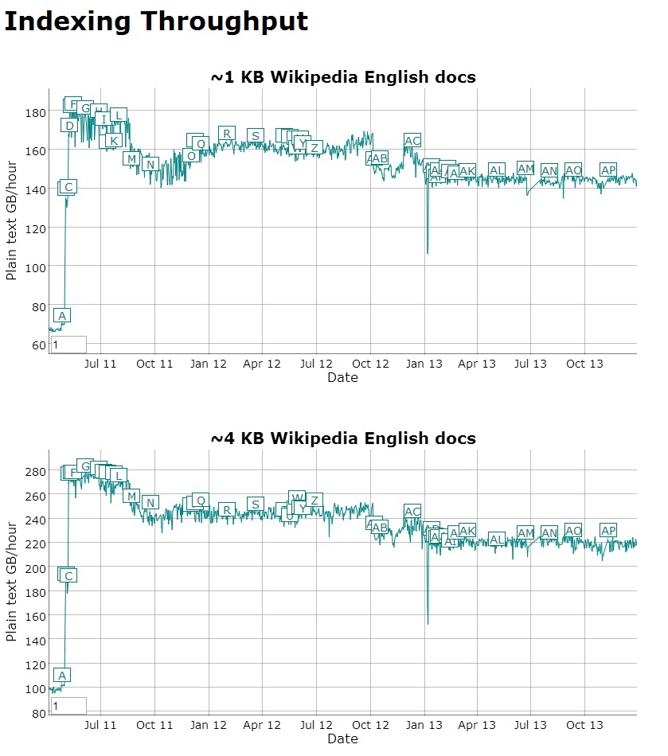

## 摘要

MapReduce 是一个编程模型，也是一个处理和生成大数据集的相关实现。用户指定一个 `map` 函数来处理一个 key/value 键值对从而生成中间结果的 key/value 键值对，然后再指定 `reduce` 函数合并所有具有同样中间 key 的中间 value。现实世界中的很多任务都能用这个模型来表示。

使用这种方式编写的程序

# Hadoop

# Apache Hadoop NextGen MapReduce (YARN)

The ResourceManager has two main components: Scheduler and ApplicationsManager.

## Lucene Features

### 可扩展的高性能索引

* 在主流硬件上实现超过 150GB/hour 的文本索引速度

    

* 内存需求小
* 增量索引同批量索引一样快
* 索引大小大概是索引文本的 20% ~ 30% 大小

### 强大准确高效的搜索算法

* 基于 rank 的搜索，优先返回最佳的结果
* 

对于 Hadoop 的集群来讲，可以分成两大类角色： Master 和 Salve 。一个 HDFS 集群是由一个 NameNode 和若干个 DataNode 组成的。其中 NameNode 作为主服务器，管理文件系统的命名空间和客户端对文件系统的访问操作；集群中的 DataNode 管理存 储的数据。 MapReduce 框架是由一个 单独运行在主节点上的 JobTracker 和 运行在每个集群从节点的 TaskTracker 共同 组成的。主节点负责调度构成一个作业的所有任务，这些任务分布在不同的从节点上。主节点监控它们的执行情况，并且重新执行之前的失败任务；从节点仅负责由主节点指派的任务。当一个 Job 被提交 时， JobTracker 接收到提交作 业和配置信息之后，就会将配置信息等分发给从节点，同时调度任务并监控 TaskTracker 的 执行。
　　从上面的介 绍可以看出， HDFS 和 MapReduce 共同 组成了 Hadoop 分布式系 统体系结构的核心。 HDFS 在集群上 实现分布式文件系统， MapReduce 在集群上 实现了分布式计算和任务处理。 HDFS 在 MapReduce 任 务处理过程中提供了文件操作和存储等支持， MapReduce 在 HDFS 的基 础上实现了任务的分发、跟踪、执行等工作，并收集结果，二者相互作用，完成了 Hadoop 分布式集群的主要任 务。

    cd /usr/loccal/src/
    tar zxvf server-jre-7u45-linux-x64.tar.gz
    mv jdk1.7.0_45/ /usr/local/

    cat >> /etc/profile.d/java.sh <<'EOF'
    export JAVA_HOME=/usr/local/jdk1.7.0_45
    export PATH=$PATH:$JAVA_HOME/bin
    export CLASSPATH=.:$JAVA_HOME/lib/tools.jar:$JAVA_HOME/lib/dt.jar:$JAVA_HOME/lib
    EOF

    source /etc/profile.d/java.sh

    cd /usr/loccal/src/
    tar zxvf hadoop-2.2.0.tar.gz
    mv hadoop-2.2.0/ /usr/local/

NameNode    ResourceManager DataNode    NodeManager

    cd /usr/local/src/
    tar zxf solr-4.6.0.tgz
    cd solr-4.6.0/example/
    java -jar start.jar

http://localhost:8983/solr/

    cat >> /etc/profile.d/hadoop.sh <<'EOF'
    export HADOOP_COMMON_HOME=/usr/local/hadoop-2.2.0
    export HADOOP_HDFS_HOME=$PATH:$JAVA_HOME/bin
    export HADOOP_MAPRED_HOME =.:$JAVA_HOME/lib/tools.jar:$JAVA_HOME/lib/dt.jar:$JAVA_HOME/lib/:
    export HADOOP_YARN_HOME
    export PATH=$HADOOP_COMMON_HOME/bin:$HADOOP_HDFS_HOME/bin:$PATH
    EOF

    source /etc/profile.d/java.sh

Setting up a Single Node Cluster

    cd /usr/loccal/src/
    tar zxvf hbase-0.94.14.tar.gz
    mv hbase-0.94.14 /usr/local/