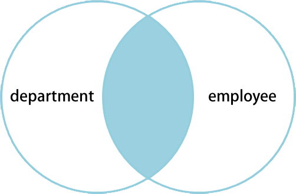
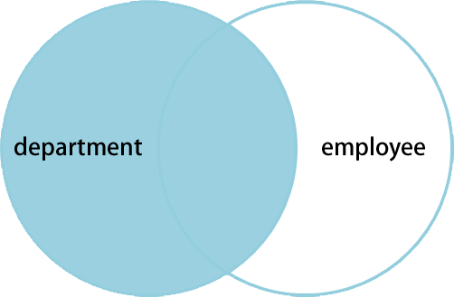
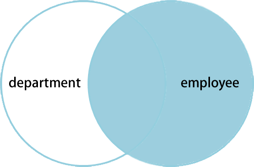
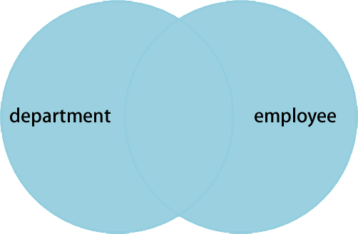

**File Name** sql-joins.md  

**Description** SQL 中的 join   
**Author** LiCunchang(printf@live.com)  
**Version** 1.0.20130526  

------

有两张表：**department** 和 **employee**，数据结构和数据如下：

**department**

    SQL> SELECT * FROM department

     department_id | department_name 
    ---------------+-----------------
                 1 | Sales
                 2 | Marketing
                 3 | Engineering
                 4 | Clerical
    (4 行记录)

**employee**

    SQL> SELECT * FROM employee

     department_id | employee_name
    ---------------+---------------
                 1 | Rafferty
                 3 | Jones
                 3 | Steinberg
                 4 | Robinson
                 4 | Smith
            [NULL] | John
    (6 行记录)

PostgreSQL 代码(MySQL 对某些 SQL 语法不支持)如下：

    CREATE TABLE department(
        department_id    SMALLINT,
        department_name  VARCHAR(20)
    );

    CREATE TABLE employee(
        department_id    SMALLINT,
        employee_name    VARCHAR(20)
    );

    INSERT INTO department VALUES('1', 'Sales');
    INSERT INTO department VALUES('2', 'Marketing');
    INSERT INTO department VALUES('3', 'Engineering');
    INSERT INTO department VALUES('4', 'Clerical');

    INSERT INTO employee VALUES('1', 'Rafferty');
    INSERT INTO employee VALUES('3', 'Jones');
    INSERT INTO employee VALUES('3', 'Steinberg');
    INSERT INTO employee VALUES('4', 'Robinson');
    INSERT INTO employee VALUES('4', 'Smith');
    INSERT INTO employee VALUES(NULL, 'John');

## 1 内连接(inner join)

内连接 **inner join** 基于连接谓词将两张表的列组合在一起，产生新的结果表。是两个表的[笛卡尔积（Cartesian product）](http://en.wikipedia.org/wiki/Cartesian_product)中选取属性间满足一定条件记录的操作。

显式 **inner join** 如下：

    SQL> SELECT * FROM department INNER JOIN employee ON department.department_id = employee.department_id

     department_id | department_name | department_id | employee_name 
    ---------------+-----------------+---------------+---------------
                 1 | Sales           |             1 | Rafferty
                 3 | Engineering     |             3 | Steinberg
                 3 | Engineering     |             3 | Jones
                 4 | Clerical        |             4 | Smith
                 4 | Clerical        |             4 | Robinson
    (5 行记录)

可以不使用 `INNER JOIN`，把表名用逗号隔开放到 `FROM` 字段，这样就是隐式 **inner join** ：

    SQL> SELECT * FROM department, employee WHERE department.department_id = employee.department_id

     department_id | department_name | department_id | employee_name 
    ---------------+-----------------+---------------+---------------
                 1 | Sales           |             1 | Rafferty
                 3 | Engineering     |             3 | Steinberg
                 3 | Engineering     |             3 | Jones
                 4 | Clerical        |             4 | Smith
                 4 | Clerical        |             4 | Robinson
    (5 行记录)

上面的基于相等运算符的连接叫做等值连接(equi join)，它只是连接谓词用了相等比较的 **inner join**，SQL 提供了一种可选的简短符号去表达相等连接——使用 `USING` 关键字：

    SQL> SELECT * FROM department INNER JOIN employee USING(department_id)

     department_id | department_name | employee_name 
    ---------------+-----------------+---------------
                 1 | Sales           | Rafferty
                 3 | Engineering     | Steinberg
                 3 | Engineering     | Jones
                 4 | Clerical        | Smith
                 4 | Clerical        | Robinson
    (5 行记录)

`USING` 在这里不仅仅是个[语法糖（Syntactic sugar）](http://en.wikipedia.org/wiki/Syntactic_sugar)，上面查询的结果和使用显式谓词得到的查询得到的结果是不同的：特别地，在 USING 部分列出的列(column)将以只出现一次。

同样也可以使用其他运算符，譬如下面的当然也是 **inner join**：

    SQL> SELECT * FROM department INNER JOIN employee ON department.department_id > employee.department_id

     department_id | department_name | department_id | employee_name 
    ---------------+-----------------+---------------+---------------
                 2 | Marketing       |             1 | Rafferty
                 3 | Engineering     |             1 | Rafferty
                 4 | Clerical        |             1 | Rafferty
                 4 | Clerical        |             3 | Jones
                 4 | Clerical        |             3 | Steinberg
    (5 行记录)

只不过这条语句的结果没有任何意义。

自然连接(Natural join)是等值连接(equi join)的进一步特例化。两表做自然连接时，两表中的**所有名称相同的列**都将被比较，这是隐式的。自然连接得到的结果表中，两表中名称相同的列只出现一次。

上面的等值连接可以用自然连接的方式表示如下:

    SQL> SELECT * FROM employee NATURAL JOIN department

     department_id | employee_name | department_name 
    ---------------+---------------+-----------------
                 1 | Rafferty      | Sales
                 3 | Jones         | Engineering
                 3 | Steinberg     | Engineering
                 4 | Robinson      | Clerical
                 4 | Smith         | Clerical
    (5 行记录)

**inner join** 可以用下面的文氏图（[Venn diagram](http://en.wikipedia.org/wiki/Venn_diagram "Venn diagram")）大概表示。

## 2 交叉连接(cross join)

交叉连接(cross join)，又称笛卡尔连接(cartesian join)或叉乘(Product)，它是所有类型的内连接的基础。把表视为行记录的集合，交叉连接即返回这两个集合的笛卡尔积。这其实等价于内连接的链接条件为“永真”，或连接条件不存在。

显式的交叉连接如下：

    SQL> SELECT * FROM department CROSS JOIN employee

     department_id | department_name | department_id | employee_name 
    ---------------+-----------------+---------------+---------------
                 1 | Sales           |             1 | Rafferty
                 1 | Sales           |             3 | Jones
                 1 | Sales           |             3 | Steinberg
                 1 | Sales           |             4 | Robinson
                 1 | Sales           |             4 | Smith
                 1 | Sales           |        [NULL] | John
                 2 | Marketing       |             1 | Rafferty
                 2 | Marketing       |             3 | Jones
                 2 | Marketing       |             3 | Steinberg
                 2 | Marketing       |             4 | Robinson
                 2 | Marketing       |             4 | Smith
                 2 | Marketing       |        [NULL] | John
                 3 | Engineering     |             1 | Rafferty
                 3 | Engineering     |             3 | Jones
                 3 | Engineering     |             3 | Steinberg
                 3 | Engineering     |             4 | Robinson
                 3 | Engineering     |             4 | Smith
                 3 | Engineering     |        [NULL] | John
                 4 | Clerical        |             1 | Rafferty
                 4 | Clerical        |             3 | Jones
                 4 | Clerical        |             3 | Steinberg
                 4 | Clerical        |             4 | Robinson
                 4 | Clerical        |             4 | Smith
                 4 | Clerical        |        [NULL] | John
    (24 行记录)

隐式交叉连接：

    SQL> SELECT * FROM department, employee

     department_id | department_name | department_id | employee_name
    ---------------+-----------------+---------------+---------------
                 1 | Sales           |             1 | Rafferty
                 1 | Sales           |             3 | Jones
                 1 | Sales           |             3 | Steinberg
                 1 | Sales           |             4 | Robinson
                 1 | Sales           |             4 | Smith
                 1 | Sales           |        [NULL] | John
                 2 | Marketing       |             1 | Rafferty
                 2 | Marketing       |             3 | Jones
                 2 | Marketing       |             3 | Steinberg
                 2 | Marketing       |             4 | Robinson
                 2 | Marketing       |             4 | Smith
                 2 | Marketing       |        [NULL] | John
                 3 | Engineering     |             1 | Rafferty
                 3 | Engineering     |             3 | Jones
                 3 | Engineering     |             3 | Steinberg
                 3 | Engineering     |             4 | Robinson
                 3 | Engineering     |             4 | Smith
                 3 | Engineering     |        [NULL] | John
                 4 | Clerical        |             1 | Rafferty
                 4 | Clerical        |             3 | Jones
                 4 | Clerical        |             3 | Steinberg
                 4 | Clerical        |             4 | Robinson
                 4 | Clerical        |             4 | Smith
                 4 | Clerical        |        [NULL] | John
    (24 行记录)

交叉连接**不会应用任何谓词**去过滤结果表中的记录。

## 3 外连接(outer join)

外连接(outer join)并不要求连接的两表的每一条记录在对方表中都一条匹配的记录。连接表保留所有记录——甚至这条记录没有匹配的记录也要保留！外连接可依据连接表保留左表、右表或全部表的行而进一步分为左外连接(left outer join), 右外连接(right outer join)和全外连接(full outer join)。left<左> 和 right<右> 表示 JOIN 关键字的两边。

在标准的 SQL 语言中, 外连接没有隐式的连接符号.

## 3.1 左外连接(left outer join)

左外连接(left outer join)，亦简称为左连接(left join), 若 A 和 B 两表进行左外连接, 那么结果表中将包含"左表"(即表 A)的所有记录，即使那些记录在"右表" B 没有符合连接条件的匹配。这意味着即使 ON 语句在 B 中的匹配项是0条， 连接操作还是会返回一条记录, 只不过这条记录的中来自于 B 的每一列的值都为 NULL。这意味着左外连接会返回左表的所有记录和右表中匹配记录的组合(如果右表中无匹配记录, 来自于右表的所有列的值设为 NULL). 如果左表的一行在右表中存在多个匹配行, 那么左表的行会复制和右表匹配行一样的数量, 并进行组合生成连接结果.

    SQL> SELECT * FROM employee LEFT OUTER JOIN department ON employee.department_id = department.department_id

     department_id | employee_name | department_id | department_name 
    ---------------+---------------+---------------+-----------------
                 1 | Rafferty      |             1 | Sales
                 3 | Jones         |             3 | Engineering
                 3 | Steinberg     |             3 | Engineering
                 4 | Robinson      |             4 | Clerical
                 4 | Smith         |             4 | Clerical
            [NULL] | John          |        [NULL] | [NULL]
    (6 行记录)

这个查询的是列出每个雇员所在的部门，即使该雇员不在任何部门任职。

**Left outer join** 可以用下面的文氏图（[Venn diagram](http://en.wikipedia.org/wiki/Venn_diagram "Venn diagram")）大概表示。

## 3.2 右外连接(right outer join)

右外连接(left outer join)， 亦简称右连接(left join)， 它与左外连接完全类似, 只不过是作连接的表的顺序相反而已. 如果 A 表右连接 B 表, 那么"右表" B 中的每一行在连接表中至少会出现一次. 如果 B 表的记录在"左表" A 中未找到匹配行, 连接表中来源于 A 的列的值设为 NULL。

右连接操作返回右表的所有行和这些行在左表中匹配的行(没有匹配的, 来源于左表的列值设为 NULL)。

    SQL> SELECT * FROM employee RIGHT OUTER JOIN department ON employee.department_id = department.department_id

     department_id | employee_name | department_id | department_name 
    ---------------+---------------+---------------+-----------------
                 1 | Rafferty      |             1 | Sales
            [NULL] | [NULL]        |             2 | Marketing
                 3 | Steinberg     |             3 | Engineering
                 3 | Jones         |             3 | Engineering
                 4 | Smith         |             4 | Clerical
                 4 | Robinson      |             4 | Clerical
    (6 行记录)

这个查询的是每个部门下的雇员，即使是没有雇员在该部门任职。

当然了，左连接和右连接是可以相互转换的——换换表的位置就可以了。

**right outer join** 可以用下面的文氏图（[Venn diagram](http://en.wikipedia.org/wiki/Venn_diagram "Venn diagram")）大概表示。

## 3.1 全连接(full outer join)

全连接(full outer join)是左右外连接的并集. 连接表包含被连接的表的所有记录, 如果缺少匹配的记录, 即以 NULL 填充.

例如：我们查看每一个在部门里的员工和每一个拥有雇员的部门, 同时, 还能看到不在任何部门的员工以及没有任何员工的部门.

    SQL> SELECT * FROM department FULL OUTER JOIN employee ON department.department_id = employee.department_id

     department_id | department_name | department_id | employee_name
    ---------------+-----------------+---------------+---------------
                 1 | Sales           |             1 | Rafferty
                 2 | Marketing       |        [NULL] | [NULL]
                 3 | Engineering     |             3 | Steinberg
                 3 | Engineering     |             3 | Jones
                 4 | Clerical        |             4 | Smith
                 4 | Clerical        |             4 | Robinson
            [NULL] | [NULL]          |        [NULL] | John
    (7 行记录)

一些数据库系统(如 MySQL)并不直接支持全连接，但它们可以通过左右外连接的并集(参: union)来模拟实现. 和上面等价的实例:
    
    SQL> SELECT * FROM employee LEFT JOIN department ON employee.department_id = department.department_id UNION SELECT * FROM employee RIGHT JOIN department ON employee.department_id = department.department_id WHERE employee.department_id IS NULL

     department_id | employee_name | department_id | department_name 
    ---------------+---------------+---------------+-----------------
                 1 | Rafferty      |             1 | Sales
                 4 | Robinson      |             4 | Clerical
            [NULL] | John          |        [NULL] | [NULL]
                 3 | Steinberg     |             3 | Engineering
            [NULL] | [NULL]        |             2 | Marketing
                 3 | Jones         |             3 | Engineering
                 4 | Smith         |             4 | Clerical
    (7 行记录)

**full outer join** 可以用下面的文氏图（[Venn diagram](http://en.wikipedia.org/wiki/Venn_diagram "Venn diagram")）大概表示。

## References

1. A Visual Explanation of SQL Joins [http://www.codinghorror.com/blog/2007/10/a-visual-explanation-of-sql-joins.html](http://www.codinghorror.com/blog/2007/10/a-visual-explanation-of-sql-joins.html "A Visual Explanation of SQL Joins")    
2. “Getting” Joins [http://www.khankennels.com/blog/index.php/archives/2007/04/20/getting-joins/](http://www.khankennels.com/blog/index.php/archives/2007/04/20/getting-joins/ "“Getting” Joins")
3. Join (SQL) [http://en.wikipedia.org/wiki/Join_\(SQL\)](http://en.wikipedia.org/wiki/Join_(SQL) "Join (SQL)")
3. Cartesian product [http://en.wikipedia.org/wiki/Cartesian_product](http://en.wikipedia.org/wiki/Cartesian_product "Cartesian product")
